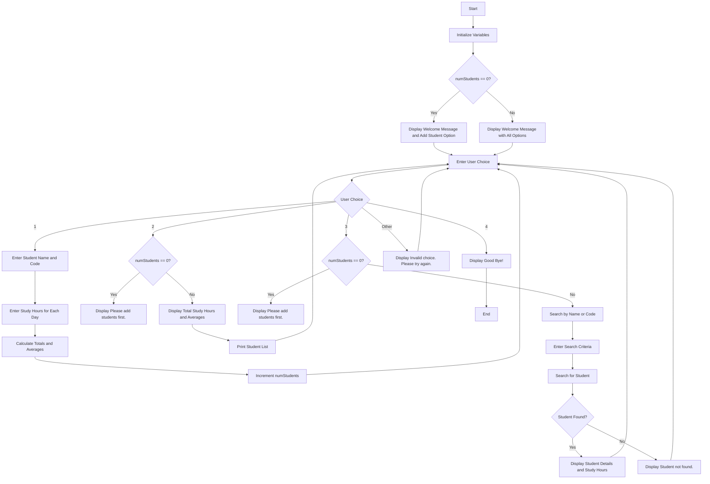

Problem Analysis
Input

1.User Choices:
 • Option to add a student.
 • Option to view total study hours    and averages.
 • Option to search for a student by name or code.
2.Student Inputs:
 • Student name and code.
 • Daily study hours for a week.
 
Output

1.Display Messages:
 • Welcome messages based on the number of students.
 • Total study hours and averages for all students.
 • Details of a specific student if found.
 • Messages for invalid choices or when no students are added.
 2.Reports:
 • Total weekly study hours.
 • Average daily study hours.
 • Breakdown of study hours for each day.
 
Operations

1.Adding Students:
 • Input student name and code.
 • Input daily study hours.
 • Calculate totals and averages.
2.Viewing Data:
 • Check if there are students added.
 • Display study hours and averages.
 • Print a list of all students.
3.Searching for Students:
 • Input search criteria.
 • Search and display details if the student is found.

### Flow Chart

