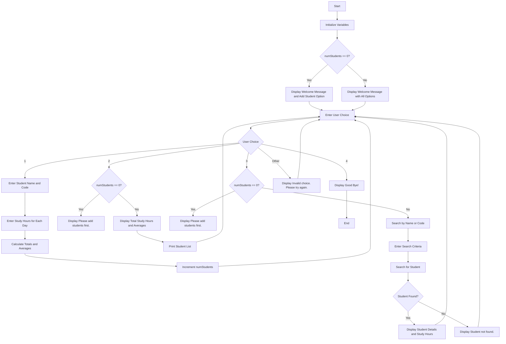

### Problem Analysis
#### Input

**User Choices:**

 1. Option to add a student.
 2. Option to view total study hours    and averages.
 3. Option to search for a student by name or code.
 
**Student Inputs:**

 1. Student name and code.
 2. Daily study hours for a week.
 
#### Output

**Display Messages:**

 1. Welcome messages based on the number of students.
 2. Total study hours and averages for all students.
 3. Details of a specific student if found.
 4. Messages for invalid choices or when no students are added.

 **Reports:**

 1. Total weekly study hours.
 2. Average daily study hours.
 3. Breakdown of study hours for each day.
 
#### Operations

**Adding Students:**

 1. Input student name and code.
 2. Input daily study hours.
 3. Calculate totals and averages.
    
**Viewing Data:**

 1. Check if there are students added.
 2. Display study hours and averages.
 3. Print a list of all students.
    
**Searching for Students:**

 1. Input search criteria.
 2. Search and display details if the student is found.

### Flow Chart

